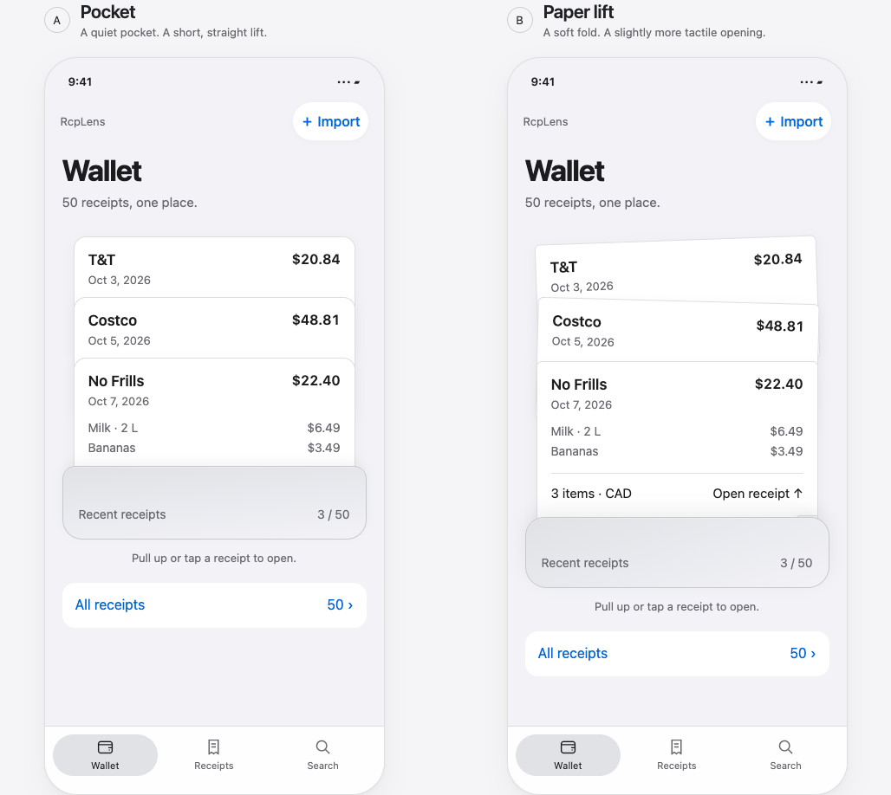

# T02 · Wallet interface concepts

Artifact work complete, 2026-10-07. **User selected Paper lift** after main-chat review. No production app source changed. The main chat owns product/task/progress updates and commit/push.

Open [index.html](index.html) directly in a browser. No server, account, network requests or build are required. Both concepts are interactive and share the same digital receipt layout. Review controls change collection, screen, text scale, appearance, motion and scenario together; each phone's normal navigation works independently.

## Direction to choose

| | A · Pocket | B · Paper lift |
|---|---|---|
| Feeling | Restrained native pocket with aligned slips | The same quiet palette, with a subtle fold and small paper tilt |
| Opening | Short straight lift; 180 ms transition | Slight lift and tilt; 260 ms transition |
| Recent receipt | Store, date, total, two item previews | Same fields, plus a small item-count/opening line |
| Tradeoff | More compact; All receipts sits higher | More physical character; takes about 52 px more space |
| Large text / Reduce Motion | Full-size recent list / direct tap | Same accessible alternatives |

**Accepted direction: Paper lift.** The user prefers its physical character. The earlier Pocket recommendation was superseded by this choice.

**Native implementation requirements for T05:** use restrained shadows to indicate wallet/slip/receipt layers, and native Liquid Glass interactions for appropriate bottom navigation and buttons. Prefer standard SwiftUI controls and supported glass APIs; the browser prototype does not demonstrate Apple's live refraction/material behaviour. Keep receipt contents readable and solid. Respect Reduce Motion, reduced transparency and increased contrast. No logo, brand colour, real texture or named-wallet model is approved. The neutral colours and standard blue actions are concept values, not final tokens. Both concepts use one collection.



## Shared receipt and navigation contract

The saved/reviewed digital receipt always orders information as **store → purchase date and currency → items and line amounts → subtotal → discounts → tax → total**. A store's paper layout never changes this structure. Store, date, item names, quantities and amounts can be edited in the review flow; the original remains separate. Review flags use plain text and source access, with no invented confidence score. The prototype shows a $1 difference when an item edit leaves the recorded total unreconciled; Save remains disabled until reconciled.

Wallet exposes only the three latest receipts. All receipts uses descending month groups, a store filter and a direct month picker. Search covers synthetic store, corrected item text, raw description, SKU and bilingual examples; results show the matched item and open its receipt with that item marked. Original evidence remains reachable from details, review and failed import. Empty and no-result states have actionable recovery.

| Synthetic collection | Walkthrough and organization |
|---|---|
| 5 | Three latest in the pocket; all five fit a short chronological list. T&T filter finds one; milk finds two. |
| 50 | Wallet stays at three; All receipts initially shows 25 with an explicit next page. Month and merchant narrow browsing. |
| 500 | Wallet stays at three; list starts at 25, then adds 25 per action. Month picker reaches the oldest month directly; merchant+month and search avoid paging through the collection. Milk finds 167; T&T/SKU/bilingual searches remain local and usable. |

The list paging is a browser-review mechanism, not a mandated native implementation. T07 should use a lazy native list and verify real indexing, scrolling and device performance. No performance claim is made from this preview.

## Review guide

1. Pull the newest receipt upward or tap any exposed store header. Open Edit, change a line amount, observe the difference, then adjust the recorded total and save. Open Original and check that the synthetic source remains unchanged.
2. Open All receipts. Try 5, 50 and 500; select a store and the oldest month. Clear filters; use next-page and item/SKU/bilingual search. Open a result and its original.
3. Import enters Reading receipt. The **outside demo control** explicitly advances to review or failure; no fake OCR timer runs. Leave and reopen processing, cancel it, retry a failure or use manual entry. Review requires confirming the flagged item. Nothing is uploaded or persisted.
4. Preview Empty wallet and No search results. Repeat with a small screen, 200% text, dark appearance and Reduce Motion.

## Accessibility handoff

- Every exposed receipt is a real button with a store/date/total/state accessible name. Tap, Enter and Space provide an alternative to dragging. Visual front-to-back positioning does not change DOM reading order: newest first.
- The pull is an optional 64 px upward movement on the pocket slips, not an app-wide gesture. Normal list scrolling remains native. Production must test touch gesture arbitration and system back gestures.
- From 150% text, the pocket changes to full-width recent receipt buttons: no overlap, rotation or hidden secondary text. Labels wrap, filters stack and line amounts move below item text when needed. Scrolling reaches the remaining fields/actions; text is never shrunk to fit.
- Use SwiftUI semantic text styles and native form/search/list/navigation components in production; the browser's 100/150/200% controls approximate reflow and do **not** test native Dynamic Type categories.
- VoiceOver approach: receipt buttons announce store/date/amount/state, then activate Open; detail reads item name, quantity and line amount before totals. Search results announce the matched item. Editing fields are labeled, and reconciliation/import failures are announced without animation-frame chatter. Restore focus to the originating receipt when closing; announce save once. Browser names and keyboard activation were checked; actual VoiceOver/Switch Control testing remains for native T05.
- The OS/browser `prefers-reduced-motion` setting and the review checkbox both remove lift/tilt animation and drag handling, leaving tap navigation. No looping progress animation or parallax. Production should use SwiftUI `accessibilityReduceMotion` and standard opaque alternatives for reduced transparency/increased contrast; browser contrast/transparency controls are not a full native audit.
- Product actions are at least 44 px high; exposed slip headers are 70 px apart. The native target is Apple's 44 pt minimum, not an assertion that CSS pixels reproduce physical iOS points.

## Evidence and limits

[Browser checks](evidence/browser-checks.json) records **124 passed checks**, zero page-runtime errors, the Chrome version and review time. [verify-design.cjs](verify-design.cjs) is a focused, dependency-free walkthrough script apart from an existing Playwright/Chrome installation; it is not a production test framework.

The checked layout matrix includes small (320 × 690) and large (430 × 932) screens, default and 200% text, and all nine essential states; no horizontal overflow was detected. Regular 393 × 852 screens were reviewed in the images below. Both Light/Dark visuals and normal/reduced motion were reviewed. Screenshots capture settled transitions.

- [Common receipt detail](evidence/receipt-detail.png)
- [Small screen / 200% text / 500-receipt browsing](evidence/small-large-text-library.png)
- [Large dark screen / item search / 500 receipts](evidence/large-dark-search.png)
- [Failed reading with evidence and manual-entry recovery](evidence/reading-failed.png)
- [Empty wallet](evidence/empty-wallet.png)

This is HTML/CSS design evidence, not pixel-exact native iOS 27 UI or a simulator build. Import/OCR is simulated. Evidence is an immutable **synthetic transcription placeholder**, not a photo viewer; native image zoom/text alternatives remain T05 work. Edits are memory-only and reset with reload/cohort change. No private receipts were inspected or embedded. Deliberate unreconciled fixtures are marked Needs review; all other fixtures use coherent integer-cent arithmetic. Synthetic taxes are examples, not retailer/tax-rule validation. No real-receipt accuracy, storage durability, security, native VoiceOver or device performance is claimed.

Reproduce with the bundled runtime on this Mac:

```sh
PLAYWRIGHT_MODULE=/Users/moby/.cache/codex-runtimes/codex-primary-runtime/dependencies/node/node_modules/playwright \
  /Users/moby/.cache/codex-runtimes/codex-primary-runtime/dependencies/node/bin/node \
  docs/design/verify-design.cjs
```

Elsewhere, set `PLAYWRIGHT_MODULE` to an existing Playwright module and `CHROME_EXECUTABLE` to an installed Chrome executable. No installation is needed or performed by this script.

## Apple sources checked

Reviewed 2026-10-07 using current official pages, without copying template assets:

- [Apple Design Resources](https://developer.apple.com/design/resources/) currently lists iOS 27/iPadOS 27 UI kits and SF Symbols 27. The browser study uses system font fallbacks and simple substitute symbols; it does not claim to reproduce that kit.
- [HIG · Materials](https://developer.apple.com/design/human-interface-guidelines/materials): functional controls/navigation sit above the content; keep the receipt readable and opaque, using effects sparingly. The pocket is an original content illustration, not a custom Liquid Glass receipt surface.
- [HIG · Accessibility](https://developer.apple.com/design/human-interface-guidelines/accessibility): support enlarged text, legible contrast and assistive technologies. This informs the reflow/labels and the native-test handoff above.
- [HIG · Gestures](https://developer.apple.com/design/human-interface-guidelines/gestures): preserve standard interactions and give alternative input methods. This informs the always-available tap path.
- [UI Design Dos and Don'ts](https://developer.apple.com/design/tips/): minimum 44 pt tappable controls and readable layouts.
- [Reduced Motion evaluation criteria](https://developer.apple.com/help/app-store-connect/manage-app-accessibility/reduced-motion-evaluation-criteria): respond to the system preference and remove depth-related motion triggers.

## Next handoff

The main chat can review the standalone page/screenshots, record the user's chosen direction, update only T02's registry entry/current progress, then commit/push the approved artifacts. T05 consumes the chosen wallet treatment and shared receipt/navigation/accessibility contract after its other dependencies. This task does not start T03 or implement app UI.
