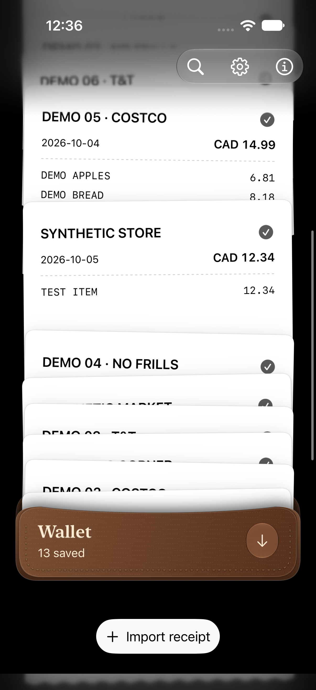
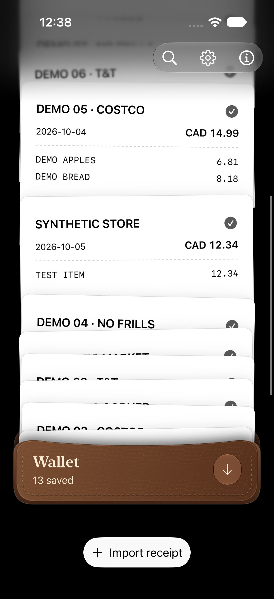

# Bottom cover follows the wallet without exposing the screen edge

The pocket backing’s top moves with the wallet. Its old fixed height also lifted its bottom above the screen during upward drift, allowing receipt paper to show beneath the action bar. Extending its height by the upward travel keeps the bottom covered while retaining the existing feather, wallet motion, button position and departure animation.

A fictional white-paper wallet in Dark Mode reproduced the strip after a partial scroll. The same pixel check passes after the fix, alongside the existing repeated detail/return test. Release builds for Simulator and the physical iOS SDK pass. Physical SDK compilation is not a phone visual test.

